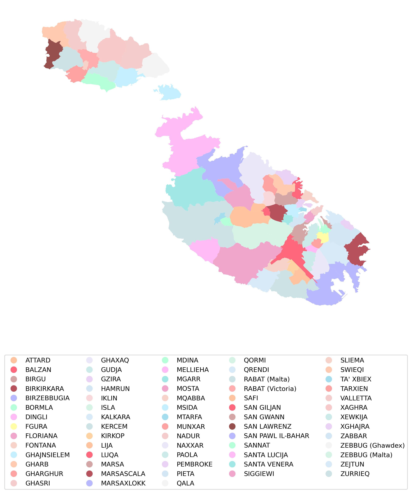

# Shapefile of Maltese localities
## tl;dr
_.shp_, _.csv_, _.geojson_ etc. are in the  folder.

## Summary
At the time of this writing, the _Administrative Units And Boundaries_ in GML format, published in the , remains locked and cumbersome to manipulate for research initiatives. 

The code in this repository extracts the administrative units' polygons from the GML and merges them with a separate list of  to curate a single data frame containing the official administrative ID, its all-important geometry, and a recognisable locality name with various English and Maltese aliases (e.g. San Ġiljan and Saint Julian's, Valletta and Il-Belt Valletta, Marsaskala, Marsascala, and Wied il-Għajn, etc.). 

Manual intervention was necessary in cases where automated matching (using ) failed, as was the case with Marsa, Marsaskala, and Marsaxlokk, for example. 

The resultant _.csv_, _.shp_, _.geojson_ etc. files in the  folder can now, quite simply, be loaded into an environment as a basemap for spatial analysis and/or visualisation, or be modified and enhanced as necessary.

Saħħa u sliem!

